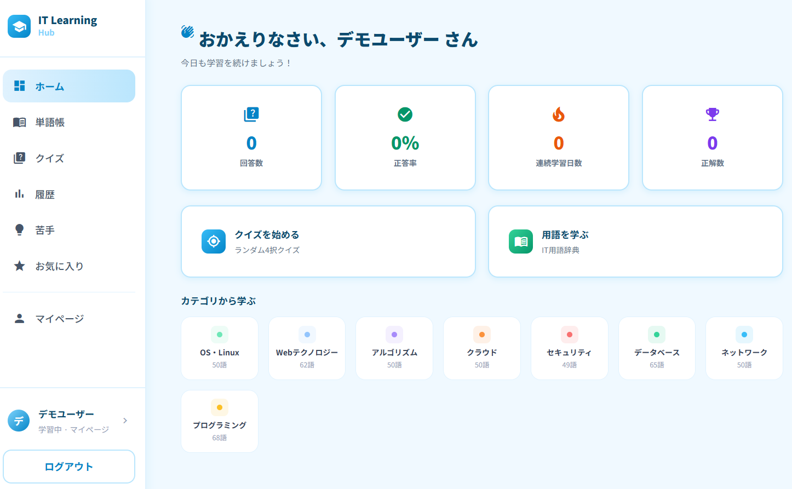
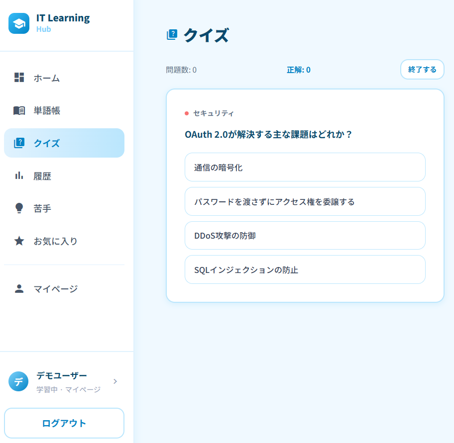
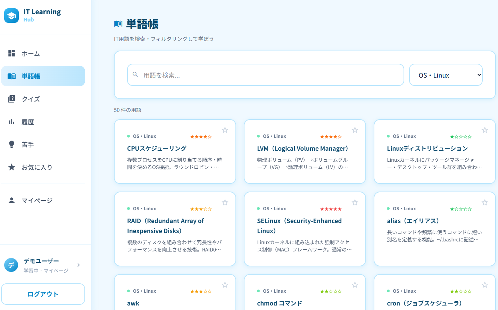
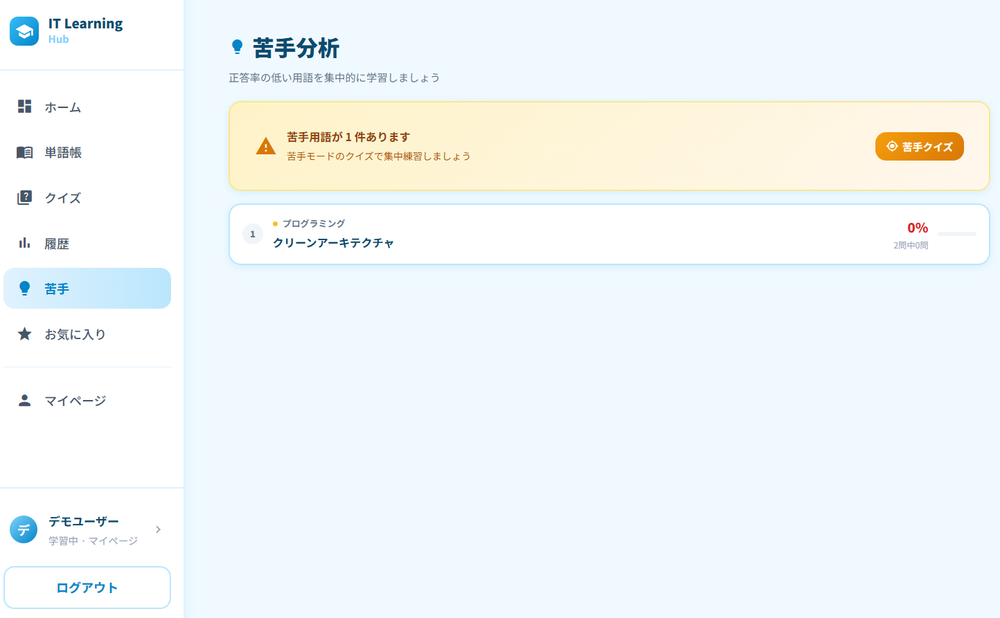
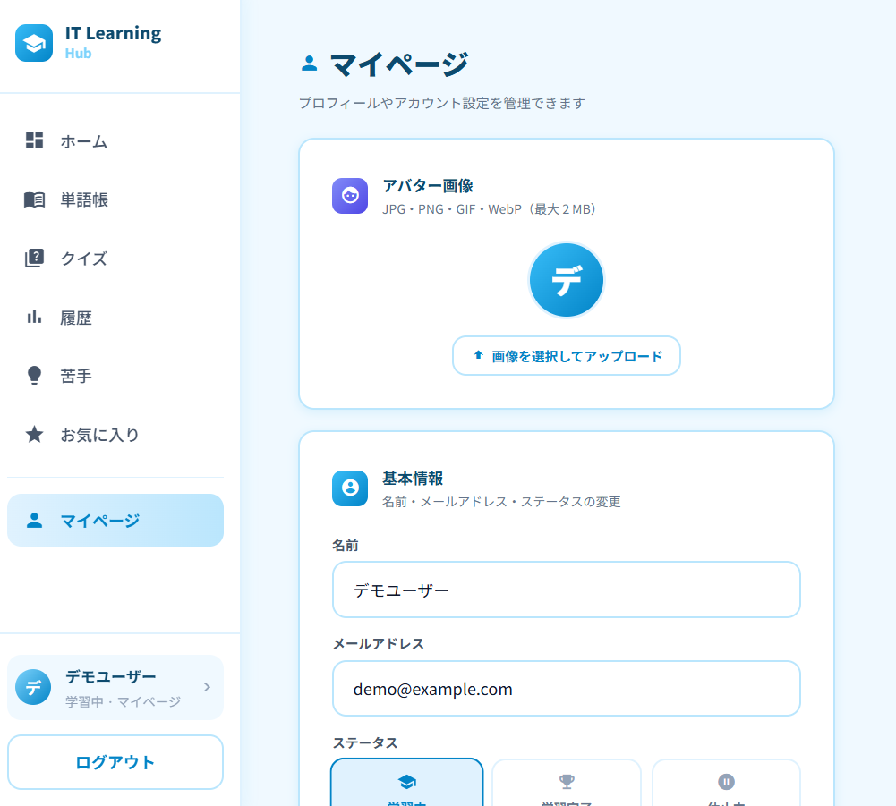

# IT Learning Hub

IT エンジニアを目指す学習者のための **IT 用語学習 Web アプリ**です。  
クイズ・単語帳・学習履歴・苦手分析など、効率的に IT 用語を習得できる機能を揃えています。

---

## スクリーンショット

| ダッシュボード | クイズ |
|---|---|
|  |  |

| 単語帳 | 苦手分析 |
|---|---|
|  |  |

| マイページ |
|---|
|  |

---

## デモアカウント

| 項目 | 値 |
|---|---|
| メールアドレス | `demo@example.com` |
| パスワード | `password` |

---

## 機能一覧

| 機能 | 説明 |
|---|---|
| **ダッシュボード** | 学習進捗・正答率・今日のおすすめ用語をひと目で確認 |
| **クイズ** | カテゴリ・難易度を選んで 4 択クイズに挑戦。正誤と解説を即時表示 |
| **単語帳** | 444 語の IT 用語を検索・カテゴリ別に閲覧。お気に入り登録可能 |
| **学習履歴** | クイズ結果の推移をグラフで確認。月別・カテゴリ別集計 |
| **苦手分析** | 正答率が低い用語を自動抽出して重点学習 |
| **お気に入り** | 気になる用語をブックマーク。後でまとめて復習 |
| **マイページ** | アバター画像・名前・メール・ステータスを編集。パスワード変更・退会機能 |

---

## IT 用語データベース

- **444 語** ／ **8 カテゴリ**
  - ネットワーク / セキュリティ / データベース / OS・インフラ / アルゴリズム / プログラミング / クラウド / Web 技術
- 各用語に **定義・具体例・難易度・クイズ問題（4 択＋解説）** を収録

---

## 技術スタック

### バックエンド

| 技術 | バージョン |
|---|---|
| PHP | ^8.2 |
| Laravel | ^12.0 |
| Laravel Sanctum | SPA 認証 |
| SQLite | ローカル DB |

### フロントエンド

| 技術 | バージョン |
|---|---|
| Vue 3 | ^3.5 |
| TypeScript | ~6.0 |
| Vite | ^8.0 |
| Tailwind CSS | ^4.3 (v4) |
| Pinia | ^3.0 |
| Vue Router | ^4.6 |

---

## ローカル開発環境のセットアップ

### 前提条件

- PHP 8.2 以上
- Composer
- Node.js 18 以上
- npm

### 手順

```bash
# 1. リポジトリをクローン
git clone <リポジトリ URL>
cd it-learning-hub

# 2. バックエンドの依存パッケージをインストール
composer install

# 3. 環境変数ファイルを作成
cp .env.example .env
php artisan key:generate

# 4. データベースを初期化（マイグレーション＋シーディング）
php artisan migrate --seed

# 5. ストレージリンクを作成（アバター画像配信用）
php artisan storage:link

# 6. フロントエンドの依存パッケージをインストール
cd frontend
npm install
cd ..

# 7. 開発サーバーを起動（バックエンド）
php artisan serve

# 8. 開発サーバーを起動（フロントエンド）— 別ターミナルで
cd frontend
npm run dev
```

起動後、ブラウザで `http://localhost:5173` にアクセスしてください。

### 一括起動（PowerShell）

```powershell
.\start.ps1
```

---

## ディレクトリ構成

```
it-learning-hub/
├── app/
│   ├── Http/Controllers/Api/   # API コントローラ
│   └── Models/                 # Eloquent モデル
├── database/
│   ├── migrations/             # DB マイグレーション
│   └── seeders/                # IT 用語シーダー
├── routes/
│   └── api.php                 # API ルーティング
├── frontend/                   # Vue 3 フロントエンド
│   ├── src/
│   │   ├── pages/              # 各ページコンポーネント
│   │   ├── stores/             # Pinia ストア
│   │   ├── layouts/            # レイアウトコンポーネント
│   │   └── style.css           # グローバルスタイル
│   └── vite.config.ts
└── docs/screenshots/           # アプリのスクリーンショット
```

---

## API エンドポイント（主要）

| メソッド | エンドポイント | 説明 |
|---|---|---|
| POST | `/api/login` | ログイン |
| POST | `/api/register` | 新規登録 |
| POST | `/api/logout` | ログアウト |
| GET | `/api/terms` | 用語一覧取得 |
| GET | `/api/terms/{id}` | 用語詳細取得 |
| GET | `/api/categories` | カテゴリ一覧 |
| POST | `/api/quiz/start` | クイズ開始 |
| POST | `/api/quiz/{id}/answer` | クイズ回答 |
| GET | `/api/history` | 学習履歴取得 |
| GET | `/api/favorites` | お気に入り一覧 |
| PUT | `/api/user/profile` | プロフィール更新 |
| POST | `/api/user/avatar` | アバター画像更新 |
| PUT | `/api/user/password` | パスワード変更 |
| DELETE | `/api/user/history` | 学習履歴リセット |
| DELETE | `/api/user` | アカウント削除 |

---

## ライセンス

MIT License
